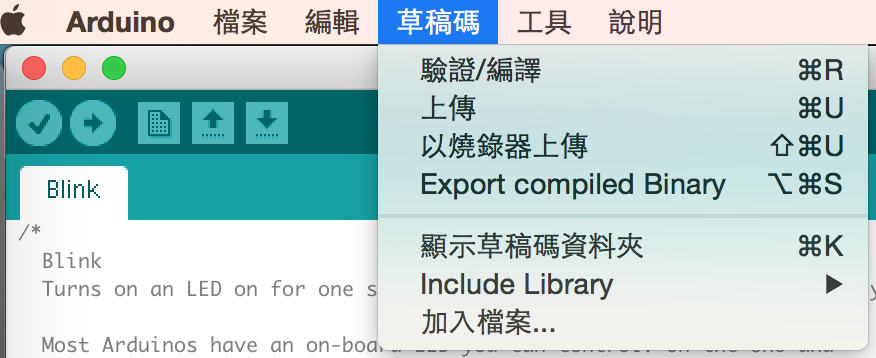

## FOTA

FOTA 全名是 Firmware Over The Air.
以下為簡單 Demo，透過 MCS 介面空中更新 firmware 給LinkIt smart 7688 Duo 的 Arduino，第一次按下 Push 鈕為『更新每 1s 閃爍一次』第二次按下 Push 鈕為『更新每 100ms 閃爍一次』：

https://www.youtube.com/watch?v=njv5SzlUkMI 

### 如何從 Arduino IDE build 出 hex 檔 for Arduino chip?

* 準備好您寫好的 Arduino code:

* 點選草稿碼:

* 點選 `Export compiled Binary`，之後就會產生出這一個 `.hex`:


這個 `.hex` 的檔案就是等等要上傳到 MCS 的 firmware.

### 在 LinkIt smart 7688 所需要的準備。
* ssh 進去 LinkIt smart 7688 
* create new folder 
* npm init
* npm install mcsjs
* copy this code:

```js
var mcs = require('mcsjs');
var spawn = require('child_process').spawn;
var fs = require('fs');
var request = require('superagent');
var fwName = 'fw.hex';

var myApp = mcs.register({
  deviceId: 'Dl7MESWf',
  deviceKey: 'm7dcQ5BHAld83X1e',
});

var download = function(url, dest, cb) {
  var file = fs.createWriteStream(dest);
  var sendReq = request.get(url);

  // verify response code
  sendReq.on('response', function(response) {
    if (response.statusCode !== 200) {
      return cb('Response status was ' + response.statusCode);
    }
  });

  // check for request errors
  sendReq.on('error', function (err) {
    fs.unlink(dest);

    if (cb) {
      return cb(err.message);
    }
  });
  sendReq.pipe(file);                                                   
                                                                        
  file.on('finish', function() {                                              
    file.close(cb);  // close() is async, call cb after close completes.      
  });                                                                         
                                                                              
  file.on('error', function(err) { // Handle errors                           
    fs.unlink(dest); // Delete the file async. (But we don't check the result)
                                                                              
    if (cb) {                                                                 
      return cb(err.message);                                                 
    }                                                                         
  });                                                                         
};                                                                            
                                                                              
myApp.on('FOTA', function(data, time) {                                                                                                  
  console.log(data);                                                                                                                     
  var Data = data.split(',');                                                                                                            
  var firmwareUrl = Data[2];                                                                                                             
  download(firmwareUrl, fwName, function(){                                                                                              
    var update = spawn('avrdude', ['-p', 'm32u4', '-c', 'linuxgpio', '-v', '-e', '-U', 'flash:w:/root/'+ fwName, '-U', 'lock:w:0x0f:m']);
    update.stdout.on('data', function(data) { console.log(data) });                                                                      
    update.stderr.on('data', function(data) { console.log(data.toString()) });                                                           
  });
});
```

* 若您希望每次開機時啟動這段 code 

### 如何利用 MCSjs 利用 FOTA 更新 Arduino?

* 首先，先進去你的 Protoype:

* 點選firmare

* 點選 Add firmware，打入以下資料( File upload 就是上傳從Arduino IDE 所輸出的 .hex 檔):

* 進到第二步驟後，按下`Next`:

* 完成後，點選 Done:

* 若您尚未創建 Test device，請記得在頁面上點選` Create test device`
* 進去您產生好的 Test device 頁面
* 點選 firmware :

* 若您的 Device 已在線上，這個 Push 按鈕就會變成藍色，點擊後就可以進行 FOTA 推送新的 firmware 給 7688 囉。
