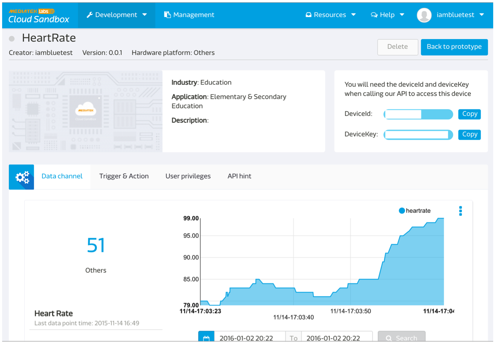

## 上傳資料到 MCS (以手指心跳感應器為例)



##本篇適用於 LinkIt smart 7688 Duo.


### 簡述

用 LinkIt smart 7688 Duo 接上 Heart Rate sensor ，來實作 MPU(MT7688) chip 如何從 MCU chip (Arduino 32U4) 接收資料後上傳到 MCS  

### 架構
在Arduino (MCU) 埋一個 57600 的Serial print傳送給 MPU，MPU端透過 node-serialport 接收資料後再透過 mcsjs 上傳到 MCS 去。


### 在 MCS 網站上設定好device

* create new protoype.
* 創建 display datachannel -> 資料形式 為 float -> datachannel ID 為 `heartrate`
* create test device.
* 在 test device 這頁上會看到 deviceID 跟 deviceKey.

### MCU 端要做的事情

請將下列的 code 燒錄進 MCU: 注意關鍵在 `Serial1.begin(57600)`:

```c
#include <Wire.h>
void setup() {
  Serial.begin(9600);
  Serial1.begin(57600); // Important! communicate with MT7688
  Serial.println("heart rate sensor:");
  Wire.begin();
}
void loop() {
  Wire.requestFrom(0xA0 >> 1, 1);   
  while(Wire.available()) {          
    unsigned char c = Wire.read();   
    Serial.begin(9600);
    Serial1.println(c, DEC);         // print heart rate value, Send this data to MT7688
  }
  delay(50);
}

```

### MPU 端要做的事情

* ssh 進去 Duo.
* 創建資料夾: `mkdir app && cd app`
* npm 初始化: `npm init`
* 安裝 mcsjs : `npm install mcsjs`
* 創建 app.js: `vim app.js`
* copy following code 和存檔: 

```js
var mcs = require('mcsjs');
var SerialPort = require("serialport").SerialPort
var serialPort = new SerialPort("/dev/ttyS0", {
  baudrate: 57600
});

var myApp = mcs.register({
 deviceId: 'Input your deviceId',
 deviceKey: 'Input your deviceKey',
});


serialPort.on("open", function () {
  serialPort.on('data', function(data) {
    // Receive data from Arduino chip (32U4)
    myApp.emit('heartrate','', data); // upload to MCS
  });
});

```

* 執行 `node app`
* 接下來就可以看到成果囉！

