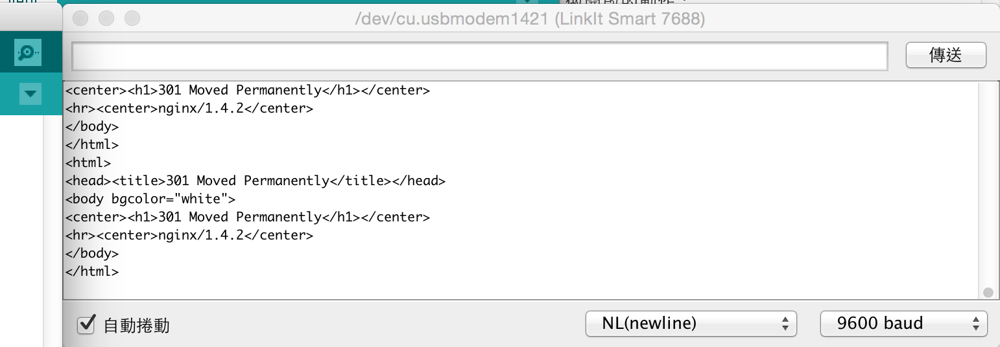

## Educational programs

We observed that Maker in education can be divided into two groups: one capable of using of Linux and the other one not.

 Elementary or high school students do not have basic Linux knowledge. Besides, Arduino communities already have a variety of open source software with drag and drop GUI interface (such as Scratch), so this group would majorly use the Arduino as the main development environment. In education, we recommend:

* Elementary and junior high schools: LinkIt smart 7688 Duo
* Senior high schools and universities: LinkIt smart 7688 or LinkIt smart 7688 Duo

This section provide to those who are to provide "elementary and junior high schools" educational resources and textbooks.

## Open the Yunbridge on LinkIt smart 7688 Duo

Most Internet of Things projects needs wifi, and MT7688 Duo may provide wifi to the Arduino chip (32U4) which does not have wifi. However,  default operation on Duo takes MPU (MT7688) and MCU (Arduino) as backup.  If it need to turn to a MCU (Arduino) major, MPU (MT7688) minor system, it need to do something to open up the Yunbridge:

* Enter advanced WebUI, set the Duo to station mode to connect to the external network.
* ssh into LinkIt smart 7688 Duo:
```
    ssh root@mylinkit.local
```
* Turn yunbridge on:
```
    uci set yunbridge.config.disabled=0
```
* Save the above commit:
```
    uci commit
```
* Reboot:
```
    reboot
```

## In Arduino side, use HttpClient to make sure bridge has been open.

* Open your Arduino IDE.
* File -> example -> Bridge -> HttpClient
* Burn this example into board.
* Open Arduino monitor window (magnifying glass icon). If this screen is seen, it succeeds.
* 

## After preparing the above materials, you can let students to concentrate on the development of the Internet of Things project on Arduino IDE.